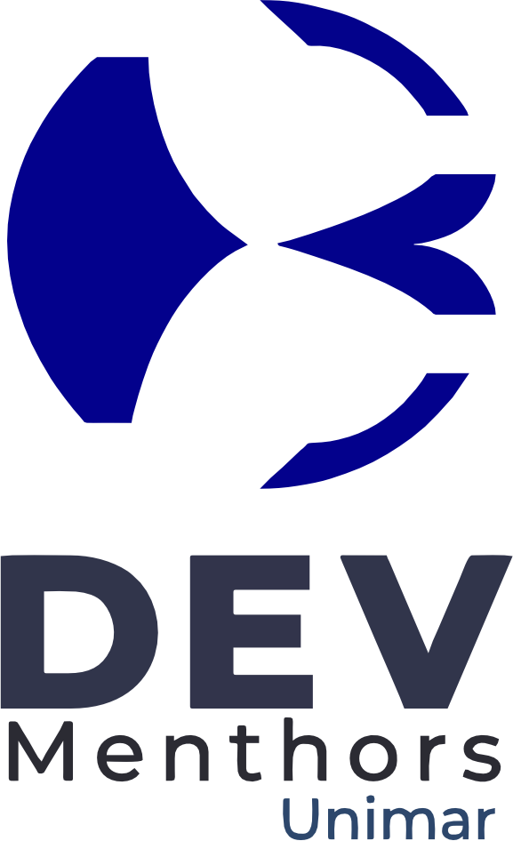

# DevMenthors - Sistema de Cronograma Inteligente

<p align="center">
  
</p>

O DevMenthors Cronograma é uma solução completa para a gestão e automação do rodízio de professores e mentores. O sistema foi desenvolvido para resolver a complexidade de alocação mensal, garantindo que as regras de negócio sejam aplicadas de forma justa e automática.

---

## Funcionalidades Principais

### Automação de Rodízio
- Algoritmo Inteligente: Gera a escala completa do mês com um clique, distribuindo professores e mentores entre as turmas Pleno e Junior.
- Equilíbrio de Carga: Garante que todos os professores tenham pelo menos 1 sábado de folga por mês.
- Gestão de Suplentes: Alocação automática de suplentes baseada na hierarquia (professores para turmas avançadas, mentores para iniciantes).

### Planejamento Pedagógico Persistente
- Células Independentes: Os nomes das aulas são salvos de forma independente das alocações. Se você trocar o professor, o nome da aula permanece lá.
- Sincronização Mensal: Os dados são salvos por mês/ano, permitindo um histórico completo e planejamento futuro.

### Segurança e Controle
- Ações Administrativas: Operações críticas como "Gerar Rodízio" ou "Limpar" são protegidas por um Modal de Confirmação com Senha.
- Drag & Drop: Interface intuitiva que permite ajustes manuais rápidos arrastando nomes da barra lateral diretamente para as turmas.

### Interface Premium
- Design Moderno: Uso de glassmorphism, micro-animações e paleta de cores harmoniosa.
- Sidebar Dinâmica: Listagem em tempo real de professores, mentores e contador de alocações mensais.

---

## Stack Tecnológica

- Backend: PHP / Laravel Framework
- Frontend: Tailwind CSS, Alpine.js
- Banco de Dados: SQLite
- Build Tool: Vite

---

## Estrutura do Projeto (Principais Pastas)

- app/Http/Controllers: Lógica de gerenciamento do cronograma e requisições AJAX.
- app/Models: Definições de banco de dados (Pessoas, Turmas, Entradas de Cronograma, Aulas, Suplentes).
- app/Services: O coração do sistema, contendo o ScheduleGenerator (algoritmo de rodízio) e ScheduleValidator (regras de negócio).
- database/migrations: Estrutura de tabelas do sistema.
- resources/views: Interface do usuário dividida em componentes Blade reutilizáveis.
- resources/js/alpine-components.js: Toda a inteligência e interatividade do lado do cliente.

---

## Como Executar o Projeto

1. Clone o repositório:
   ```bash
   git clone https://github.com/MateusAmaroDaSilva/Cronograma-DevMenthors.git
   ```

2. Instale as dependências:
   ```bash
   composer install
   npm install
   ```

3. Configure o ambiente:
   - Renomeie .env.example para .env
   - Crie um arquivo de banco de dados vazio em database/database.sqlite

4. Prepare o banco de dados:
   ```bash
   php artisan migrate --seed
   ```

5. Compile os assets e inicie o servidor:
   ```bash
   npm run build
   php artisan serve
   ```

---

## Credenciais de Administrador
Para realizar ações de geração ou limpeza, é necessária a senha administrativa definida pelo gestor do sistema.

---

## Licença
Este projeto é de uso exclusivo para a escola DevMenthors.

---
*Desenvolvido para a comunidade DevMenthors.*
